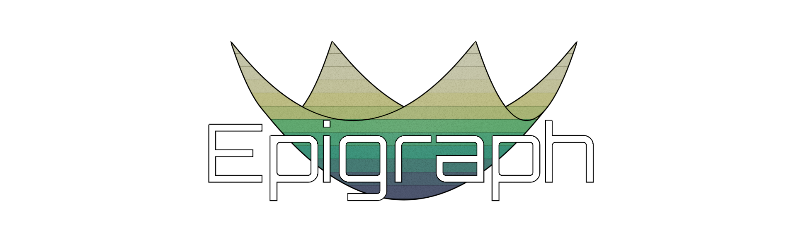

<p align="center">
    
</p>

<p align="center">
<a href="https://shields.io/" alt="">
    </a>
<a href="https://shields.io/" alt="">
    </a>
<a href="https://shields.io/" alt="">
    </a>
<a href="https://github.com/EmbersArc/Epigraph/blob/master/LICENSE" alt="">
    </a>
<a href="https://travis-ci.org/github/EmbersArc/Epigraph" alt="">
    </a>
<a href="https://codecov.io/gh/EmbersArc/Epigraph" alt="">
    </a>
</p>

Epigraph is a modern C++ interface to formulate and solve linear, quadratic and second order cone problems. It makes use of Eigen types and operator overloading for straightforward problem formulation.

## Features
* Flexible and intuitive way to formulate LPs, QPs and SOCPs
* Dynamic parameters that can be changed without re-formulating the problem
* Automatically clean up the problem and remove unused variables
* Print the problem formulation and solver data for inspection

## Dependencies

* [Eigen](http://eigen.tuxfamily.org)
* [fmt](https://github.com/fmtlib/fmt) (optional, only for tests)

## Supported Solvers

The solvers are included as submodules for convenience. Note that some solvers have more restrictive licenses which automatically override the Epigraph license when activated. Pass the listed argument to cmake during configuration to enable the solvers.

### QP 
* [OSQP](https://github.com/oxfordcontrol/osqp) `-DENABLE_OSQP=TRUE`. Apache-2.0 License.

### SOCP
* [ECOS](https://github.com/embotech/ecos) `-DENABLE_ECOS=TRUE`. GPLv3 License.
* [EiCOS](https://github.com/embersarc/eicos) `-DENABLE_EICOS=TRUE`. MIT License.

## Usage

### Download
```
git clone --recurse-submodules https://github.com/EmbersArc/Epigraph
```

### CMake
To use Epigraph with a cmake project, simply enable the desired solvers, include the subdirectory and link the library.
```
set(ENABLE_OSQP TRUE)
set(ENABLE_ECOS TRUE)
set(ENABLE_EICOS TRUE)
add_subdirectory(Epigraph)
target_link_libraries(my_library epigraph)
```

### Documentation

While the example below is likely enough to get you started, the full documentation can be found [here](https://embersarc.github.io/Epigraph/).

### Example

```cpp
#include "epigraph.hpp"

#include <fmt/format.h>
#include <fmt/ostream.h>

// This example solves the portfolio optimization problem in QP form

using namespace cvx;

int main()
{
    size_t n = 5; // Assets
    size_t m = 2; // Factors

    fmt::print("Running with assets: {}, factors: {}\n", n, m);

    // Set up problem data.
    double gamma = 0.5;          // risk aversion parameter
    Eigen::VectorXd mu(n);       // vector of expected returns
    Eigen::MatrixXd F(n, m);     // factor-loading matrix
    Eigen::VectorXd D(n);        // diagonal of idiosyncratic risk
    Eigen::MatrixXd Sigma(n, n); // asset return covariance

    mu.setRandom();
    F.setRandom();
    D.setRandom();

    mu = mu.cwiseAbs();
    F = F.cwiseAbs();
    D = D.cwiseAbs();
    Sigma = F * F.transpose();
    Sigma.diagonal() += D;

    // Formulate QP.
    OptimizationProblem qp;

    // Declare variables with...
    // addVariable(name) for scalars,
    // addVariable(name, rows) for vectors and
    // addVariable(name, rows, cols) for matrices.
    VectorX x = op.addVariable("x", n);

    // Available constraint types are equalTo(), lessThan(), greaterThan() and box()
    qp.addConstraint(greaterThan(x, 0.));
    qp.addConstraint(equalTo(x.sum(), 1.));

    // Make mu dynamic in the cost function so we can change it later
    qp.addCostTerm(x.transpose() * par(gamma * Sigma) * x - dynpar(mu).dot(x));

    // Print the problem formulation for inspection
    fmt::print("{}\n", qp);

    // Create and initialize the solver instance.
    osqp::OSQPSolver solver(qp);

    // Print the canonical problem formulation for inspection
    fmt::print("{}\n", solver);

    // Solve problem and show solver output
    solver.solve(true);

    fmt::print("Solver result: {} ({})\n", solver.getResultString(), solver.getExitCode());
    // Call eval() to get the variable values
    fmt::print("Solution 1:\n {}\n", eval(x));

    // Update data
    mu.setRandom();
    mu = mu.cwiseAbs();

    // Solve again
    // OSQP will warm start automatically
    solver.solve(true);

    fmt::print("Solver result: {} ({})\n", solver.getResultString(), solver.getExitCode());
    fmt::print("Solution 2:\n {}\n", eval(x));
}
```
See the [tests](tests) for more examples, including the same problem in SOCP form.

### Problem Formulation
The following terms may be passed to the constraint functions:

| Function | Allowed expressions |
| --- | --- |
| `equalTo()`|`Affine == Affine` |
| `lessThan()`| `Affine <= Affine` or `Norm2 + Affine <= Affine` (SOCP) |
| `greaterThan()`| `Affine >= Affine` or `Affine >= Norm2 + Affine` (SOCP) |
| `box()`| `Affine <= Affine <= Affine` |
| `addCostTerm()`| `Affine` (SOCP) or `QuadForm + Affine` (QP) |

With the following expressions:

| Expression | Form |
| --- | --- |
| `Affine` | `p1 * x1 + p2 * x2 + ... + c` |
| `Norm2` | `(Affine1^2  + Affine2^2 + ...)^(1/2)` |
| `QuadForm` | ``x' * P * x`` where `P` is Hermitian |
